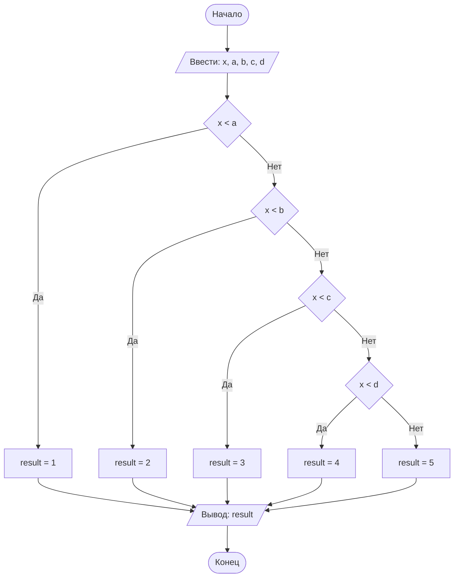

## Отчет по лабораторной работе № 1

#### № группы: `ПМ-2602`

#### Выполнила: `Селиверстова Анжелика Владимировна`

#### Вариант: `19`

### Содержание:

- [Постановка задачи](#1-постановка-задачи)
- [Входные и выходные данные](#2-входные-и-выходные-данные)
- [Выбор структуры данных](#3-выбор-структуры-данных)
- [Алгоритм](#4-алгоритм)
- [Программа](#5-программа)
- [Анализ правильности решения](#6-анализ-правильности-решения)

### 1. Постановка задачи

> На числовой прямой расположены 4 различные точки A, B, C, D (где A < B < C < D), которые разбивают числовую прямую на 5 участков (1, 2, 3, 4, 5 слева направо). В какой из участков попадает точка X? Известно, что X не равна ни одной из точек A, B, C, D. На вход программы подаются целые числа X, A, B, C, D.

Данную задачу можно разделить на 5 случаев:

1. `X < A`
2. `A < X < B`
3. `B < X < C`
4. `C < X < D`
5. `X > D`

В зависимости от положения точки `X` программа должна вывести номер соответствующего участка от `1` до `5`.

### 2. Входные и выходные данные

#### Данные на вход

На вход программа получает 5 целых чисел: `X`, `A`, `B`, `C`, `D`.

Точки `A`, `B`, `C`, `D` расположены в порядке:

`A < B < C < D`

Также известно, что точка `X` не совпадает ни с одной из точек `A`, `B`, `C`, `D`.

В условии задачи диапазон входных значений не указан. Для хранения входных данных используется тип `long`.

| Данные | Тип | min значение | max значение |
|---|---|---:|---:|
| X | Целое число | -9 223 372 036 854 775 808 | 9 223 372 036 854 775 807 |
| A | Целое число | -9 223 372 036 854 775 808 | 9 223 372 036 854 775 807 |
| B | Целое число | -9 223 372 036 854 775 808 | 9 223 372 036 854 775 807 |
| C | Целое число | -9 223 372 036 854 775 808 | 9 223 372 036 854 775 807 |
| D | Целое число | -9 223 372 036 854 775 808 | 9 223 372 036 854 775 807 |

#### Данные на выход

На выход программа должна вывести одно целое число — номер участка, в котором находится точка `X`.

Всего существует 5 участков, поэтому результат может принимать значения от `1` до `5`.

Для хранения результата используется тип `byte`, так как его диапазона достаточно для хранения всех возможных результатов.

| Данные | Тип в Java | min значение | max значение |
|---|---|---:|---:|
| Номер участка | `byte` | 1 | 5 |

### 3. Выбор структуры данных

Для хранения координат точек `X`, `A`, `B`, `C`, `D` используется тип `long`.

В условии задачи сказано, что входные значения являются целыми числами, но их диапазон не указан. Тип `long` позволяет хранить целые числа от `-9 223 372 036 854 775 808` до `9 223 372 036 854 775 807`, поэтому его диапазона достаточно для хранения больших целых значений.

Номер участка может принимать только 5 значений: `1`, `2`, `3`, `4`, `5`. Поэтому для хранения результата используется тип `byte`. Это наименьший целочисленный тип Java, имеющий диапазон от `-128` до `127`.

| Назначение | Название переменной | Тип в Java | Размер | min значение типа | max значение типа |
|---|---|---|---:|---:|---:|
| Точка X | `x` | `long` | 8 байт | -9 223 372 036 854 775 808 | 9 223 372 036 854 775 807 |
| Точка A | `a` | `long` | 8 байт | -9 223 372 036 854 775 808 | 9 223 372 036 854 775 807 |
| Точка B | `b` | `long` | 8 байт | -9 223 372 036 854 775 808 | 9 223 372 036 854 775 807 |
| Точка C | `c` | `long` | 8 байт | -9 223 372 036 854 775 808 | 9 223 372 036 854 775 807 |
| Точка D | `d` | `long` | 8 байт | -9 223 372 036 854 775 808 | 9 223 372 036 854 775 807 |
| Номер участка | `result` | `byte` | 1 байт | -128 | 127 |

Для считывания входных данных используется объект класса `Scanner`.

### 4. Алгоритм

#### Алгоритм выполнения программы:

1. **Ввод данных:**  
   Программа считывает пять целых чисел `x`, `a`, `b`, `c`, `d`.

2. **Проверка первого участка:**  
   Если `x < a`, переменной `result` присваивается значение `1`.

3. **Проверка второго участка:**  
   Если первое условие не выполнилось, проверяется условие `x < b`. Если оно истинно, переменной `result` присваивается значение `2`.

4. **Проверка третьего участка:**  
   Если предыдущие условия не выполнились, проверяется условие `x < c`. Если оно истинно, переменной `result` присваивается значение `3`.

5. **Проверка четвертого участка:**  
   Если предыдущие условия не выполнились, проверяется условие `x < d`. Если оно истинно, переменной `result` присваивается значение `4`.

6. **Проверка пятого участка:**  
   Если ни одно из предыдущих условий не выполнилось, значит `x > d`, поэтому переменной `result` присваивается значение `5`.

7. **Вывод результата:**  
   Программа выводит значение переменной `result`.

Так как по условию точка `X` не равна точкам `A`, `B`, `C`, `D`, отдельно проверять случаи равенства не требуется.

#### Блок-схема



### 5. Программа

```java
import java.util.Scanner;

public class Main {
    public static void main(String[] args) {
        Scanner in = new Scanner(System.in);

        long x = in.nextLong();
        long a = in.nextLong();
        long b = in.nextLong();
        long c = in.nextLong();
        long d = in.nextLong();

        byte result;

        if (x < a) {
            result = 1;
        } else if (x < b) {
            result = 2;
        } else if (x < c) {
            result = 3;
        } else if (x < d) {
            result = 4;
        } else {
            result = 5;
        }

        System.out.println(result);
    }
}
```

### 6. Анализ правильности решения

Для проверки правильности работы программы рассмотрим все возможные варианты расположения точки `X`, а также граничные случаи.

1. Тест на `X < A`:

    - **Input:**
        ```
        5 10 20 30 40
        ```

    - **Output:**
        ```
        1
        ```

2. Тест на `A < X < B`:

    - **Input:**
        ```
        15 10 20 30 40
        ```

    - **Output:**
        ```
        2
        ```

3. Тест на `B < X < C`:

    - **Input:**
        ```
        25 10 20 30 40
        ```

    - **Output:**
        ```
        3
        ```

4. Тест на `C < X < D`:

    - **Input:**
        ```
        35 10 20 30 40
        ```

    - **Output:**
        ```
        4
        ```

5. Тест на `X > D`:

    - **Input:**
        ```
        50 10 20 30 40
        ```

    - **Output:**
        ```
        5
        ```

6. Граничный случай с отрицательными числами. Точка `X` находится непосредственно слева от точки `B`:

    - **Input:**
        ```
        -21 -40 -20 -10 -1
        ```

    - **Output:**
        ```
        2
        ```

В данном случае выполняется условие:

`-40 < -21 < -20`

Следовательно, точка `X` находится во втором участке.

7. Граничный случай с отрицательными числами. Точка `X` находится непосредственно справа от точки `B`:

    - **Input:**
        ```
        -19 -40 -20 -10 -1
        ```

    - **Output:**
        ```
        3
        ```

В данном случае выполняется условие:

`-20 < -19 < -10`

Следовательно, точка `X` находится в третьем участке.

8. Проверка минимального значения типа `long`:

    - **Input:**
        ```
        -9223372036854775808 -9223372036854775807 -100 0 100
        ```

    - **Output:**
        ```
        1
        ```

Значение `X` является минимальным возможным значением типа `long` и находится левее точки `A`.

9. Проверка максимального значения типа `long`:

    - **Input:**
        ```
        9223372036854775807 -100 0 100 9223372036854775806
        ```

    - **Output:**
        ```
        5
        ```

Значение `X` является максимальным возможным значением типа `long` и находится правее точки `D`.

Таким образом, были проверены все 5 возможных положений точки `X`, работа программы с отрицательными числами, значения около границ участков, а также минимальное и максимальное значения типа `long`.
