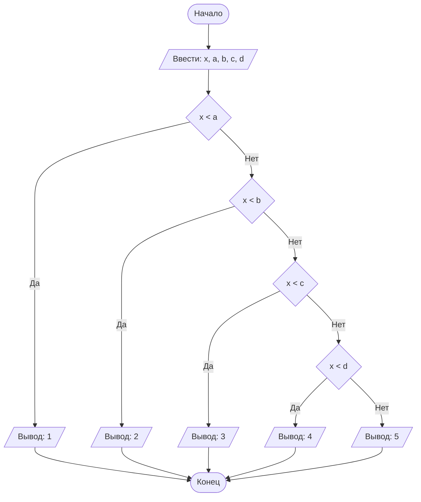

## Отчет по лабораторной работе № 1

#### № группы: `ПМ-2602`

#### Выполнил: `Селиверстова Анжелика Владимировна`

#### Вариант: `19`

### Cодержание:

- [Постановка задачи](#1-постановка-задачи)
- [Входные и выходные данные](#2-входные-и-выходные-данные)
- [Выбор структуры данных](#3-выбор-структуры-данных)
- [Алгоритм](#4-алгоритм)
- [Программа](#5-программа)
- [Анализ правильности решения](#6-анализ-правильности-решения)

### 1. Постановка задачи

> На числовой прямой расположены 4 различные точки A, B, C, D, где A < B < C < D, которые разбивают числовую прямую на 5 участков (1, 2, 3, 4, 5 слева направо). В какой из участков попадает точка X? Известно, что X не равна ни одной из точек A, B, C, D. На вход программы подаются целые числа X, A, B, C, D.

Данную задачу можно разделить на 5 случаев:

1. `X < A`
2. `A < X < B`
3. `B < X < C`
4. `C < X < D`
5. `X > D`

В зависимости от положения точки `X` программа должна вывести номер соответствующего участка от `1` до `5`.

### 2. Входные и выходные данные

#### Данные на вход

На вход программа получает 5 целых чисел: `X`, `A`, `B`, `C`, `D`.

Точки `A`, `B`, `C`, `D` расположены в порядке:

`A < B < C < D`

Также известно, что точка `X` не совпадает ни с одной из точек `A`, `B`, `C`, `D`.

Так как на вход подаются целые числа, для их хранения можно использовать тип `int`.

|             | Тип         |
|-------------|-------------|
| X           | Целое число |
| A           | Целое число |
| B           | Целое число |
| C           | Целое число |
| D           | Целое число |

#### Данные на выход

На выход программа должна вывести одно целое число — номер участка, в котором находится точка `X`.

Всего существует 5 участков, поэтому результат может принимать значения от `1` до `5`.

|               | Тип          | min значение | max значение |
|---------------|--------------|--------------|--------------|
| Номер участка | Целое число  | 1            | 5            |

### 3. Выбор структуры данных

Программа получает 5 целых чисел, поэтому для их хранения можно выделить 5 переменных типа `int`.

|             | Название переменной | Тип в Java |
|-------------|---------------------|-------------|
| Точка X     | `x`                 | `int`       |
| Точка A     | `a`                 | `int`       |
| Точка B     | `b`                 | `int`       |
| Точка C     | `c`                 | `int`       |
| Точка D     | `d`                 | `int`       |

Для считывания значений используется объект класса `Scanner`.

Для вывода результата необязательно хранить номер участка в отдельной переменной, так как после определения нужного участка его можно сразу вывести на экран.

### 4. Алгоритм

#### Алгоритм выполнения программы:

1. **Ввод данных:**
   Программа считывает пять целых чисел `x`, `a`, `b`, `c`, `d`.

2. **Проверка первого участка:**
   Если `x < a`, программа выводит `1`.

3. **Проверка второго участка:**
   Если первое условие не выполнилось, проверяется условие `x < b`. Если оно истинно, программа выводит `2`.

4. **Проверка третьего участка:**
   Если предыдущие условия не выполнились, проверяется условие `x < c`. Если оно истинно, программа выводит `3`.

5. **Проверка четвертого участка:**
   Если предыдущие условия не выполнились, проверяется условие `x < d`. Если оно истинно, программа выводит `4`.

6. **Проверка пятого участка:**
   Если ни одно из предыдущих условий не выполнилось, значит `x > d`, поэтому программа выводит `5`.

Так как по условию точка `X` не равна точкам `A`, `B`, `C`, `D`, отдельно проверять случаи равенства не требуется.

#### Блок-схема



### 5. Программа

```java
import java.util.Scanner;

public class Main {
    public static void main(String[] args) {
        // Объявляем объект класса Scanner для ввода данных
        Scanner in = new Scanner(System.in);

        // Считываем точку X и точки A, B, C, D
        int x = in.nextInt();
        int a = in.nextInt();
        int b = in.nextInt();
        int c = in.nextInt();
        int d = in.nextInt();

        // Определяем номер участка
        if (x < a) {
            System.out.println(1);
        } else if (x < b) {
            System.out.println(2);
        } else if (x < c) {
            System.out.println(3);
        } else if (x < d) {
            System.out.println(4);
        } else {
            System.out.println(5);
        }
    }
}
```

### 6. Анализ правильности решения

Программа работает корректно на всем множестве допустимых входных данных с учетом условий задачи.

1. Тест на `X < A`:

    - **Input:**

        ```text
        5 10 20 30 40
        ```

    - **Output:**

        ```text
        1
        ```

2. Тест на `A < X < B`:

    - **Input:**

        ```text
        15 10 20 30 40
        ```

    - **Output:**

        ```text
        2
        ```

3. Тест на `B < X < C`:

    - **Input:**

        ```text
        25 10 20 30 40
        ```

    - **Output:**

        ```text
        3
        ```

4. Тест на `C < X < D`:

    - **Input:**

        ```text
        35 10 20 30 40
        ```

    - **Output:**

        ```text
        4
        ```

5. Тест на `X > D`:

    - **Input:**

        ```text
        50 10 20 30 40
        ```

    - **Output:**

        ```text
        5
        ```

6. Тест с отрицательными значениями:

    - **Input:**

        ```text
        -15 -40 -20 -10 10
        ```

    - **Output:**

        ```text
        3
        ```

В данном случае выполняется условие `B < X < C`, то есть `-20 < -15 < -10`, поэтому программа выводит `3`.

Таким образом, были проверены все 5 возможных случаев расположения точки `X` на числовой прямой.
